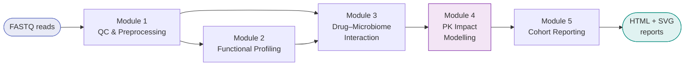

<div class="rxb-hero" markdown>

# RxBiome

**Reproducible pharmacomicrobiomics — from gut metagenome to personalised dose adjustment**

RxBiome is an nf-core–style Nextflow DSL2 pipeline that integrates shotgun metagenomics with drug pharmacokinetic (PK) modelling to predict how a patient's gut microbiome shifts drug exposure and suggest evidence-based dose adjustments.

<div class="btn-row">
  <a class="rxb-btn rxb-btn-primary" href="getting-started/">Get Started</a>
  <a class="rxb-btn rxb-btn-secondary" href="modules/">Pipeline Modules</a>
  <a class="rxb-btn rxb-btn-secondary" href="https://github.com/sanyabadole/RxBiome">GitHub</a>
</div>

</div>

## What RxBiome Does

<div class="rxb-grid" markdown>

<div class="rxb-card" markdown>
**:material-dna: QC & Classification**  
Trims reads with fastp, optionally removes host DNA with KneadData, classifies microbial taxa with Kraken2 + Bracken + MetaPhlAn.
</div>

<div class="rxb-card" markdown>
**:material-function: Functional Profiling**  
Quantifies metabolic pathways with HUMAnN3 (optional), linking taxa to metabolic function relevant to drug metabolism.
</div>

<div class="rxb-card" markdown>
**:material-pill: Drug–Microbiome Interaction**  
Scores drug–microbe interaction confidence using MicrobeRX SMILES fingerprint matching with a deterministic fallback.
</div>

<div class="rxb-card" markdown>
**:material-chart-line: PK Impact Modelling**  
Converts interaction scores into predicted clearance, AUC shifts and recommended dose changes with uncertainty intervals.
</div>

<div class="rxb-card" markdown>
**:material-file-chart: Cohort Reports**  
Generates per-patient HTML QC reports and cohort-level SVG plots and Markdown summaries ready for clinical review.
</div>

<div class="rxb-card" markdown>
**:material-check-all: Reproducible by Design**  
Pinned Docker/Conda environments, nf-core standards, deterministic algorithms, schema-validated inputs.
</div>

</div>

## Pipeline Architecture



## Quick Start

=== "Docker"

    ```bash
    nextflow run main.nf \
      -profile local,docker \
      --input samplesheet.csv \
      --drugs drug_library.csv \
      --kraken2_db /path/to/databases/kraken2 \
      --metaphlan4_db /path/to/databases/metaphlan \
      --metaphlan4_index mpa_vJan25_CHOCOPhlAnSGB_202503 \
      --skip_host_decontamination true \
      --outdir results/
    ```

=== "Conda"

    ```bash
    nextflow run main.nf \
      -profile conda \
      --input samplesheet.csv \
      --drugs drug_library.csv \
      --kraken2_db /path/to/databases/kraken2 \
      --metaphlan4_db /path/to/databases/metaphlan \
      --metaphlan4_index mpa_vJan25_CHOCOPhlAnSGB_202503 \
      --skip_host_decontamination true \
      --outdir results/
    ```

=== "Test (stubs)"

    ```bash
    nextflow run main.nf \
      -profile test,docker \
      --outdir results_test/
    ```

## Five-Module Overview

| Module | Purpose | Key tools |
|--------|---------|-----------|
| **1 — QC & Preprocessing** | Read trimming, host removal, taxonomic profiling | fastp, KneadData, Kraken2, Bracken, MetaPhlAn |
| **2 — Functional Profiling** | Pathway quantification (optional) | HUMAnN3 |
| **3 — Drug–Microbiome Interaction** | SMILES-based interaction scoring | MicrobeRX, PubChem, ChEMBL |
| **4 — PK Impact Modelling** | Dose adjustment recommendations per sample | Custom Python (pk_impact.py) |
| **5 — Cohort Reporting** | Aggregated statistics, plots, HTML patient reports | Custom Python, matplotlib, Jinja2 |

## Installation Requirements

- [Nextflow](https://nextflow.io) ≥ 23.04
- [Docker](https://docker.com) or [Conda](https://conda.io)
- ≥ 16 GB RAM (≥ 32 GB recommended for full-size samples)
- ≥ 50 GB free disk space for databases

→ [Full installation guide](getting-started/installation.md)

## Citation

If you use RxBiome in your research, please cite:

> Badole S. *RxBiome: a reproducible pharmacomicrobiomics pipeline.* GitHub (2026). https://github.com/sanyabadole/RxBiome

---

*Built with [Nextflow](https://nextflow.io) · [nf-core](https://nf-co.re) standards · MIT License*
