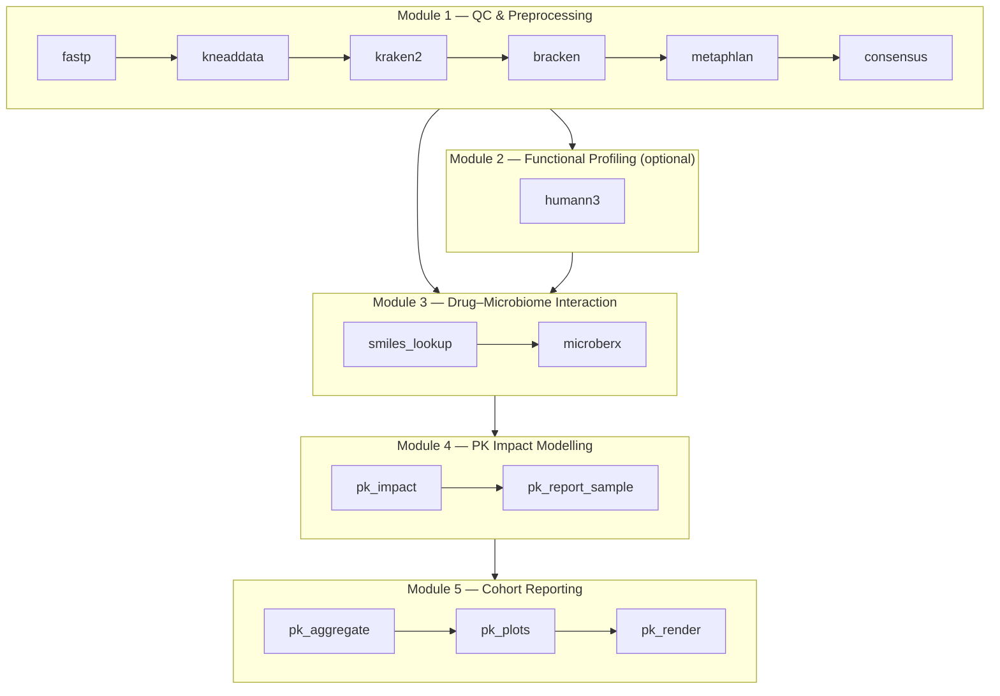

# Pipeline Modules

RxBiome is structured as five sequential modules, each implemented as an nf-core–style Nextflow subworkflow.

| Module | Subworkflow file | Key processes |
|--------|----------------|---------------|
| [1 — QC & Preprocessing](module1-qc.md) | `qc_preprocessing.nf` | FASTP, KNEADDATA, KRAKEN2, BRACKEN, METAPHLAN4, TAXONOMIC_CONSENSUS |
| [2 — Functional Profiling](module2-functional.md) | `functional_profiling.nf` | HUMANN3 |
| [3 — Drug–Microbiome Interaction](module3-interaction.md) | `drug_microbiome_interaction.nf` | DRUG_SMILES_LOOKUP, MICROBERX_PREDICT |
| [4 — PK Impact Modelling](module4-pk-impact.md) | `pk_impact_modeling.nf` | PK_IMPACT, PK_REPORT_SAMPLE |
| [5 — Cohort Reporting](module5-reporting.md) | `pk_reporting.nf` | PK_REPORT_AGGREGATE, PK_REPORT_PLOTS, PK_REPORT_RENDER |
