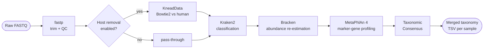

# Module 1 — QC & Preprocessing

M1 **Subworkflow:** `subworkflows/local/qc_preprocessing.nf`

## Overview

Module 1 takes raw paired-end FASTQ reads, trims adapters, optionally removes host DNA, classifies microbial taxa, and produces a consensus taxonomy table for each sample.

## Processes

### FASTP

| Item | Detail |
|------|--------|
| Tool | [fastp](https://github.com/OpenGene/fastp) |
| Container | `community.wave.seqera.io/library/fastp:1.1.0` |
| Label | `process_medium` |
| Purpose | Adapter trimming, quality filtering, read QC report |

fastp runs in paired-end mode with automatic adapter detection (`--detect_adapter_for_pe`). It outputs trimmed FASTQ files plus an HTML/JSON QC report that feeds into the final MultiQC report.

### KNEADDATA

| Item | Detail |
|------|--------|
| Tool | [KneadData](https://huttenhower.sph.harvard.edu/kneaddata/) v0.12.0 |
| Container | `quay.io/biocontainers/kneaddata:0.12.0--pyhdfd78af_1` |
| Label | `process_high` |
| Purpose | Host read decontamination via Bowtie2 alignment |
| Skip with | `--skip_host_decontamination true` |

KneadData aligns trimmed reads against the human genome index and discards any reads that align. The remaining reads are considered microbial. Trimming (`--bypass-trim`) and TRF (`--bypass-trf`) are bypassed since fastp already handles trimming upstream.

The input decompress step (`zcat → .fastq`) and output recompression (`gzip`) are performed in-process to avoid staging multi-GB uncompressed files.

### KRAKEN2

| Item | Detail |
|------|--------|
| Tool | [Kraken2](https://ccb.jhu.edu/software/kraken2/) v2.17.1 |
| Container | `quay.io/biocontainers/kraken2` |
| Label | `process_high` |
| Purpose | k-mer–based taxonomic classification |
| Database | Passed via `--kraken2_db` |

Kraken2 classifies every read in the (optionally decontaminated) FASTQ against the Standard 8 GB database. It outputs a per-read classification report and a per-taxon summary.

### BRACKEN\_BRACKEN

| Item | Detail |
|------|--------|
| Tool | [Bracken](https://ccb.jhu.edu/software/bracken/) |
| Container | nf-core community image |
| Label | `process_low` |
| Purpose | Bayesian re-estimation of abundances at species level |

Bracken takes the Kraken2 report and redistributes read counts down to the species level using k-mer database distributions, correcting for database size biases.

### METAPHLAN4

| Item | Detail |
|------|--------|
| Tool | [MetaPhlAn 4](https://github.com/biobakery/MetaPhlAn) |
| Container | `quay.io/biocontainers/metaphlan:4.1.1--pyhdfd78af_0` |
| Label | `process_medium` |
| Purpose | Species-level profiling using clade-specific marker genes |
| Database | Passed via `--metaphlan4_db` + `--metaphlan4_index` |

MetaPhlAn 4 provides an independent, marker-gene–based taxonomy profile. Its output is complementary to Kraken2 — Kraken2 is sensitive, MetaPhlAn is specific.

### TAXONOMIC\_CONSENSUS

| Item | Detail |
|------|--------|
| Tool | Custom Python (`bin/taxonomic_consensus.py`) |
| Label | `process_low` |
| Purpose | Merges Kraken2+Bracken and MetaPhlAn profiles into one consensus table |

The consensus algorithm:

1. Normalises both profiles to relative abundance.
2. Identifies species present in **both** tools above a minimum threshold.
3. For species in only one tool, applies a configurable confidence penalty.
4. Outputs a merged TSV with columns: `species`, `relative_abundance`, `source`, `confidence`.

## Key Output Files

| File | Description |
|------|-------------|
| `qc_preprocessing/{sample}.fastp.html` | Per-sample QC report |
| `qc_preprocessing/{sample}.fastp.json` | Machine-readable QC metrics |
| `qc_preprocessing/{sample}.kraken2.txt` | Kraken2 classification report |
| `qc_preprocessing/{sample}_bracken_species.txt` | Species-level abundance |
| `qc_preprocessing/{sample}_profile.txt` | MetaPhlAn 4 profile |
| `qc_preprocessing/{sample}.consensus_taxonomy.tsv` | **Merged consensus taxonomy** |

The consensus taxonomy TSV is the key input for Module 3.
