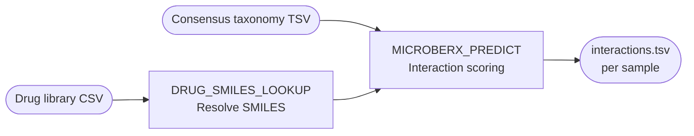

# Module 3 — Drug–Microbiome Interaction

M3 **Subworkflow:** `subworkflows/local/drug_microbiome_interaction.nf`

## Overview

Module 3 estimates how strongly each detected gut microorganism is likely to interact with each drug in the panel. It outputs a per-sample, per-drug interaction score between 0 and 1 that drives the PK impact calculation in Module 4.

## DRUG\_SMILES\_LOOKUP

| Item | Detail |
|------|--------|
| Script | `bin/drug_smiles_lookup.py` |
| Container | `biocontainers/pandas:2.2.1` |
| Label | `process_low` |
| Runs once | Yes — one invocation per pipeline run, not per sample |

This process resolves SMILES strings for drugs that don't have them pre-filled in the drug library. It queries external APIs in order:

1. **DrugBank** (if `--drugbank_api_key` provided)
2. **PubChem** (`https://pubchem.ncbi.nlm.nih.gov/rest/pug`)
3. **ChEMBL** (`https://www.ebi.ac.uk/chembl/api/data/molecule`)

The output is a resolved CSV/TSV with all SMILES filled.

!!! tip "Pre-resolve SMILES before running"
    If your compute environment lacks internet access, run `bin/drug_smiles_lookup.py` locally beforehand and pass the resolved file directly. The process detects pre-filled SMILES and skips lookups for those rows.

**Auto-detection of delimiter:** The script auto-detects whether the input drug library is comma-separated or tab-separated by inspecting the first non-comment line, preventing common read-back failures.

## MICROBERX\_PREDICT

| Item | Detail |
|------|--------|
| Script | `bin/microberx_predict.py` |
| Container | `sanyabadole/rxbiome-microberx:latest` (custom Docker image in `docker/microberx/`) |
| Label | `process_medium` |
| Runs once | Yes — per sample |

MicrobeRX uses molecular fingerprinting and a curated drug–microbe interaction database to score pairwise interactions. For each species in the consensus taxonomy:

1. The drug SMILES is converted to a Morgan circular fingerprint.
2. Fingerprint similarity (Tanimoto coefficient) is calculated against MicrobeRX reference compounds.
3. A **base interaction score** \( s_{\text{base}} \in [0, 1] \) is returned.
4. The base score is weighted by the species' **relative abundance** in that sample:

\[
\text{interaction\_confidence}_{d,k} = s_{\text{base},d,k} \times \text{rel\_abund}_k
\]

where \(d\) = drug, \(k\) = species.

5. Scores are summed across all species for each drug to get the **aggregated interaction score**:

\[
\text{MIF}_d = \sum_{k=1}^{K} s_{\text{base},d,k} \times \text{rel\_abund}_k
\]

**Deterministic fallback:** If the MicrobeRX model cannot be loaded (e.g. Docker connectivity issue), the script falls back to a rule-based scorer using DrugBank class membership and known literature associations.

## Output Files

| File | Description |
|------|-------------|
| `drug_microbiome_interaction/{sample}.interactions.tsv` | Per-drug interaction scores |
| `drug_microbiome_interaction/{sample}.dominant_species.tsv` | Top-10 species by total weighted score |

### interactions.tsv Schema

| Column | Type | Description |
|--------|------|-------------|
| `drug_name` | str | Drug identifier |
| `drug_class` | str | Pharmacological class |
| `drugbank_id` | str | DrugBank accession |
| `mif_score` | float | Microbiome Impact Factor (0–1) |
| `dominant_species` | str | Semicolon-separated top-5 contributing species |
| `n_interacting_species` | int | Number of species with score > 0 |
