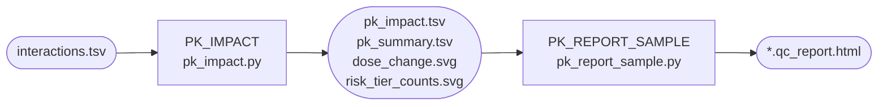

# Module 4 — PK Impact Modelling

M4 **Subworkflow:** `subworkflows/local/pk_impact_modeling.nf`

## Overview

Module 4 converts the raw microbiome–drug interaction scores from Module 3 into clinically interpretable pharmacokinetic impact predictions. For each drug and each sample, it estimates:

- Fractional change in **clearance** (Δ-clearance)
- Fractional change in **AUC** (Δ-AUC)
- Recommended **dose adjustment** (%)
- **95 % confidence interval** around the dose adjustment
- **Risk tier** (HIGH / MEDIUM / LOW)

The final output is a self-contained **HTML patient report** per sample.

## PK\_IMPACT Process

| Item | Detail |
|------|--------|
| Script | `bin/pk_impact.py` |
| Container | `biocontainers/pandas:2.2.1` |
| Label | `process_low` |
| Config dataclass | `bin/pk_impact_models.py` → `PKConfig` |

### Mathematical Model

#### Step 1 — MIF Scaling

The raw MIF score is scaled to prevent model saturation at high interaction values:

\[
\text{MIF}_{\text{scaled}} = \frac{\text{MIF}_{\text{raw}}}{\text{MIF}_{\text{raw}} + s}
\]

where \(s\) is the **MIF scale factor** (default `0.5`, configurable via `--pk_mif_scale_factor`).

This is a Michaelis–Menten–type saturation transform. It maps:
- MIF = 0 → scaled = 0
- MIF = 0.5, s=0.5 → scaled = 0.5  
- MIF → ∞ → scaled → 1.0 (never exceeds 1.0)

#### Step 2 — Clearance Effect

\[
\Delta \text{CL}_{\text{frac}} = \text{clip}\!\left(\text{MIF}_{\text{scaled}} \times 0.3,\; \text{CL}_{\min},\; \text{CL}_{\max}\right)
\]

Default clip bounds: `CL_min = -0.5`, `CL_max = 0.8`.

The ×0.3 coefficient is a biological conservatism factor: even a maximal microbiome impact (MIF_scaled = 1.0) is assumed to shift clearance by at most 30% in a single direction, absent of patient-specific data.

#### Step 3 — AUC Shift

Drug AUC is inversely related to clearance:

\[
\Delta \text{AUC}_{\text{frac}} = \text{clip}\!\left(\frac{-\Delta \text{CL}_{\text{frac}}}{1 + \Delta \text{CL}_{\text{frac}}},\; \text{AUC}_{\min},\; \text{AUC}_{\max}\right)
\]

Default clip bounds: `AUC_min = -0.6`, `AUC_max = 1.5`.

#### Step 4 — Dose Adjustment

\[
\text{dose\_adj} = -\Delta \text{AUC}_{\text{frac}}
\]

A positive dose\_adj means the microbiome is increasing drug exposure (AUC ↑), so a dose *decrease* is recommended.

#### Step 5 — Uncertainty / Confidence Interval

\[
\sigma = \text{scale} \times \lvert \Delta \text{AUC}_{\text{frac}} \rvert + \text{offset}
\]

Default: `scale = 0.15`, `offset = 0.05`.

The 95 % CI is approximated as ± 1.96 σ.

#### Step 6 — Risk Tier Classification

| Tier | Condition |
|------|-----------|
| **HIGH** | `|dose_adj| > 0.20` (> 20% dose change needed) |
| **MEDIUM** | `0.10 < |dose_adj| ≤ 0.20` |
| **LOW** | `|dose_adj| ≤ 0.10` |

### Guards and Validation

- NaN/Inf MIF values are set to 0.0 with a logged warning.
- MIF values outside [0, 1] are clipped to [0, 1] with a warning.
- Drugs missing from `--drug_pk_metadata` are logged; a `standard_dose_mg` fallback of 500 mg is used.
- A `#schema_version: 1` comment header is prepended to `pk_impact.tsv` for downstream compatibility checks.

### Configurable Parameters

| Parameter | Default | Description |
|-----------|---------|-------------|
| `--pk_mif_scale_factor` | `0.5` | MIF saturation divisor |
| `--pk_clearance_clip_min` | `-0.5` | Lower bound for Δ-clearance |
| `--pk_clearance_clip_max` | `0.8` | Upper bound for Δ-clearance |
| `--pk_auc_clip_min` | `-0.6` | Lower bound for Δ-AUC |
| `--pk_auc_clip_max` | `1.5` | Upper bound for Δ-AUC |
| `--pk_ci_base_uncertainty_scale` | `0.15` | CI width scale factor |
| `--pk_ci_min_offset` | `0.05` | Minimum CI half-width |

## PK\_REPORT\_SAMPLE Process

| Item | Detail |
|------|--------|
| Script | `bin/pk_report_sample.py` |
| Container | `biocontainers/pandas:2.2.1` + Jinja2 (installed at runtime) |
| Label | `process_low` |
| Output | `{sample}.qc_report.html` |

This process reads the four per-sample outputs from PK_IMPACT and assembles them into a single self-contained HTML file:

- **Executive summary**: counts of HIGH/MEDIUM/LOW risk drugs.
- **Embedded SVG plots**: dose change and risk tier distribution.
- **Drug interactions table**: full `pk_impact.tsv` rendered as a Bootstrap table.
- **Clinical interpretation guide**: explains tier thresholds.
- **Disclaimer footer**: "For research purposes only."

The HTML uses Bootstrap 5 CDN and all SVG content is inlined — no external file dependencies.

## Output Files

| File | Description |
|------|-------------|
| `pk_impact/{sample}.pk_impact.tsv` | Full per-drug PK predictions |
| `pk_impact/{sample}.pk_summary.tsv` | Aggregated summary per drug class |
| `pk_impact/{sample}.dose_change.svg` | Dose change waterfall plot |
| `pk_impact/{sample}.risk_tier_counts.svg` | Risk tier pie / bar chart |
| `pk_impact/{sample}.qc_report.html` | **Self-contained HTML patient report** |
