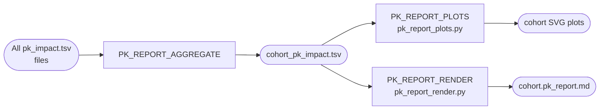

# Module 5 — Cohort Reporting

M5 **Subworkflow:** `subworkflows/local/pk_reporting.nf`

## Overview

Module 5 aggregates per-sample PK impact results across the entire cohort and generates publication-quality cohort-level visualisations and a Markdown narrative report.

## PK\_REPORT\_AGGREGATE

| Item | Detail |
|------|--------|
| Script | `bin/pk_report_aggregate.py` |
| Label | `process_low` |
| Purpose | Collect all per-sample `pk_impact.tsv` files into one table |

This step reads each per-sample TSV (skipping the `#schema_version` comment line via `comment='#'`), appends a `sample_id` column, and concatenates them into a cohort-wide DataFrame.

## PK\_REPORT\_PLOTS

| Item | Detail |
|------|--------|
| Script | `bin/pk_report_plots.py` |
| Label | `process_low` |
| Libraries | `matplotlib`, `seaborn`, `pandas`, `numpy` |
| Output | Multiple SVG files |

### Plots Generated

#### Drug Dose Change Heatmap + Mean ± SD

A three-panel figure:

- **Panel 1 (top)**: Drug × Sample heatmap of `dose_adj_fraction` values. Red = dose increase needed, blue = dose decrease needed. White = no change.
- **Panel 2 (middle)**: Risk tier annotation matrix (HIGH/MEDIUM/LOW) as a categorical heatmap.
- **Panel 3 (bottom)**: Mean ± 1 SD dose change fraction per drug, displayed as horizontal error bars, sorted by mean effect. Gives a quick sense of which drugs show consistent signals across the cohort.

#### Risk Tier Summary Bar

A stacked horizontal bar chart showing the proportion of samples in each risk tier per drug.

#### Species Contribution Heatmap

A species × drug heatmap of weighted interaction confidence, highlighting which organisms drive the PK signal.

## PK\_REPORT\_RENDER

| Item | Detail |
|------|--------|
| Script | `bin/pk_report_render.py` |
| Label | `process_low` |
| Output | `cohort.pk_report.md` |
| Input | `cohort_pk_impact.tsv` + SVG paths |

Renders a Markdown report with:

1. **Cohort Statistical Summary** table — per-drug mean ± SD dose adjustment, n samples, HIGH/MEDIUM/LOW counts.
2. **Top-5 Dominant Species** table — organisms contributing most to PK signal across the cohort.
3. **Optional QC note** — if all samples have LOW tier predictions, a caution note is appended suggesting possible microbiome homogeneity or data quality review.
4. Embedded references to cohort SVG plots.

## Output Files

| File | Description |
|------|-------------|
| `pk_report/cohort_pk_impact.tsv` | Full cohort-level PK table |
| `pk_report/cohort.drug_dose_change.svg` | Three-panel dose change + mean±SD heatmap |
| `pk_report/cohort.risk_tier_summary.svg` | Stacked bar of risk tier proportions |
| `pk_report/cohort.species_contribution.svg` | Species × drug interaction heatmap |
| `pk_report/cohort.pk_report.md` | Cohort narrative report (Markdown) |

## Interpreting the Cohort Report

### Risk Tiers

| Tier | Dose adjustment | Clinical implication |
|------|----------------|---------------------|
| **HIGH** | > 20% | Consider therapeutic drug monitoring; consult pharmacist |
| **MEDIUM** | 10–20% | Monitor for altered drug response; consider dose review |
| **LOW** | < 10% | Standard monitoring appropriate |

!!! warning "Research use only"
    RxBiome predictions are based on population-level microbiome–drug interaction data and a semi-quantitative PK model. They are **not validated for clinical decision-making**. Always involve a qualified clinical pharmacologist.

### How to Read the Heatmap

- **Red cells** = the model predicts higher-than-expected drug exposure (AUC ↑) → consider dose reduction.
- **Blue cells** = lower-than-expected exposure (AUC ↓) → consider dose increase or enhanced monitoring.
- **Intensity** = magnitude of predicted effect.
- **White** = negligible microbiome impact predicted.
